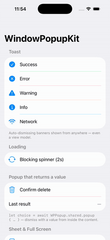
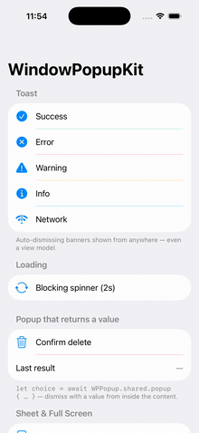
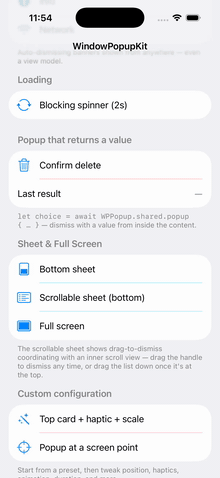
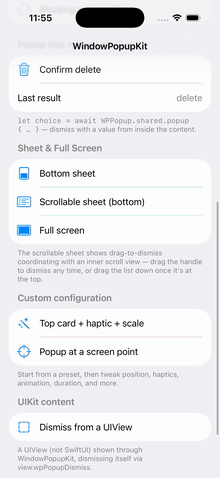
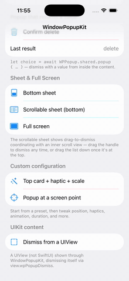
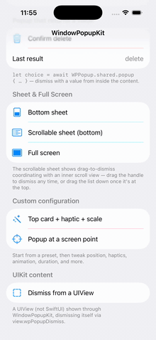

# WindowPopupKit

[](https://github.com/thuyetngocluong/WindowPopupKit/actions/workflows/ci.yml)
[](https://swift.org)
[](https://developer.apple.com/ios/)
[](https://swift.org/package-manager/)
[](LICENSE)

**Window-based popups for SwiftUI & UIKit that you can `await` for a result.**

WindowPopupKit presents toasts, popups, sheets, loading overlays and full-screen modals in their own pass-through `UIWindow` — so you can show them from **anywhere** (even a view model), above any navigation hierarchy, without polluting your view tree with `Bool` bindings. And because presentation is `async`, you can **await the user's decision and get a value back**.

```swift
let choice = await WPPopup.shared.popup {
    ConfirmDeleteView()      // calls dismiss("confirm") / dismiss("cancel")
}
if choice as? String == "confirm" { delete() }
```

## Demo

<div align="center">

<table>
  <tr>
    <td align="center"><br><sub><b>Toasts</b></sub></td>
    <td align="center"><br><sub><b>Loading overlay</b></sub></td>
    <td align="center"><br><sub><b>Await a result</b></sub></td>
  </tr>
  <tr>
    <td align="center"><br><sub><b>Bottom sheet</b></sub></td>
    <td align="center"><br><sub><b>Anchored at a point</b></sub></td>
    <td align="center"><br><sub><b>UIView content</b></sub></td>
  </tr>
</table>

</div>

## Why another popup library?

| | WindowPopupKit | Most SwiftUI popup libs |
|---|---|---|
| Presented in a separate `UIWindow` | ✅ (pass-through, auto level stacking) | sometimes |
| Call from anywhere (incl. view models) | ✅ | usually needs a `Bool` binding in the view |
| **`await` returns the user's result** | ✅ | ✗ (callbacks / bindings) |
| SwiftUI **and** `UIViewController` / `UIView` content | ✅ | SwiftUI only |
| Toast · Popup · Sheet · Loading · FullScreen presets | ✅ | varies |
| Deep config (position, interaction, scroll-to-dismiss, animation, haptics, lifecycle) | ✅ | varies |
| Zero third-party dependencies | ✅ | varies |

## Features

- **One engine, many shapes** — `toast`, `popup`, `sheet`, `loading`, `modal`, `fullScreen`, or a fully custom `WPPopupConfiguration`.
- **Async / await with return values** — `let result = await WPPopup.shared.popup { … }`; dismiss with a value via `@Environment(\.wpPopupDismiss)`.
- **Or fire-and-forget** — the non-async `showPopup(...) -> WPPopupDismissAction` returns a handle you can dismiss later.
- **SwiftUI, UIViewController, or UIView** content through the same API.
- **Pass-through window + level stacking** — popups stack at increasing window levels; touches outside content fall through (configurable).
- **Rich configuration** — position (top/center/bottom/custom point), size constraints (fill/ratio/constant/intrinsic), screen & content interaction, scroll-to-dismiss, background, shadow, rounded corners, border, entrance/exit animations (translation/scale/fade/spring), haptics, and `willAppear/didAppear/willDisappear/didDisappear` lifecycle hooks.
- **`WPToast` & `WPLoading`** built on top for the common cases.
- **Zero dependencies** — pure UIKit + SwiftUI, no third-party packages.

## Requirements

- iOS 16.0+
- Xcode 16+ (the package declares Swift tools 6.0 and compiles in the Swift 5 language mode)

## Installation

### Swift Package Manager

```swift
dependencies: [
    .package(url: "https://github.com/thuyetngocluong/WindowPopupKit.git", from: "1.0.0")
]
```

Then add `WindowPopupKit` to your target's dependencies.

## Quick start

```swift
import WindowPopupKit

// Toast (auto-dismiss)
WPToast.show(.success, message: "Saved!")

// Blocking loading overlay
WPLoading.showLoading()
// … do async work …
WPLoading.dismissLoading()

// Popup that returns a value
let result = await WPPopup.shared.popup {
    VStack(spacing: 16) {
        Text("Delete this item?")
        Button("Delete") { dismiss("delete") }   // @Environment(\.wpPopupDismiss)
        Button("Cancel") { dismiss(nil) }
    }
    .padding(24)
    .background(.regularMaterial, in: RoundedRectangle(cornerRadius: 16))
}

// Bottom sheet
await WPPopup.shared.sheet { MySheetContent() }

// Custom configuration
var config = WPPopupConfiguration.defaultPopup
config.position = .top
config.hapticFeedback = .medium
config.entranceAnimation = .scaleAndFade
await WPPopup.shared.show(configuration: config) { MyView() }
```

Dismiss with a value from inside the content:

```swift
struct ConfirmDeleteView: View {
    @Environment(\.wpPopupDismiss) private var dismiss   // returns a value
    var body: some View {
        Button("Confirm") { dismiss("confirm") }
    }
}
```

## UIKit content

The same API accepts a `UIViewController` or `UIView`, and the dismiss action is reachable through `wpPopupDismiss` on either:

```swift
// Present a view controller and await a typed result
let result: String? = await WPPopup.shared.showPopup(viewController: MyController())

// From inside UIKit content
view.wpPopupDismiss?("done")            // on a UIView
viewController.wpPopupDismiss?("done")  // on a UIViewController
```

`wpPopupDismiss` returns the dismiss action of the popup the view belongs to (its `window` is the popup window), or `nil` if the view isn't inside one.

## Customizing toasts & loading

`WPToast` ships `.success` / `.error` / `.warning` / `.info` / `.network`. Register your own view for any identifier (custom ones included):

```swift
WPToast.register(for: "promo") { message in PromoToast(text: message) }
WPToast.show("promo", message: "50% off today!")

WPToast.showExclusive(.error, message: "Only one at a time")  // replace the current stack
WPToast.dismissAll()

WPLoading.register { BrandedSpinner() }                       // swap the global loading view
```

## Example app

A runnable demo lives in [`Example/`](Example). Open `Example/Example.xcodeproj` and run on an iOS 16+ simulator to try every shape — toasts, blocking loading, an `await`-for-result confirm dialog, a draggable bottom sheet, a scrollable sheet (drag-to-dismiss coordinated with an inner scroll view), a full-screen modal, a custom top card with haptics, and a popup anchored at an absolute screen point.

## Presentation presets

`WPPopupConfiguration` ships ready-made presets: `.defaultToast`, `.defaultPopup`, `.defaultLoading`, `.defaultSheet`, `.defaultModal`, `.defaultFullScreen`, plus `defaultPopup(at:)` for an absolute screen point. Start from one and tweak.

## Key window & keyboard input

By default a popup is shown **without** becoming the key window: the app underneath keeps keyboard focus, and touches outside the popup's content fall through (pass-through window).

If your popup needs to **own keyboard input** — e.g. it contains a `TextField` — set `configuration.becomeKeyWindow = true`. This **requires full-screen constraints** (start from `.defaultFullScreen`):

```swift
var config = WPPopupConfiguration.defaultFullScreen
config.becomeKeyWindow = true
await WPPopup.shared.show(configuration: config) { MyFormWithTextField() }
```

Why full-screen? A partial popup can't coherently *be* the key window while a pass-through window still lets outside touches fall through — the key window would own keyboard/focus while most of the screen routes touches elsewhere. Full-screen content also keeps the keyboard in the safe-area regions so the layout can adapt around it. `WPPopup` asserts in debug if `becomeKeyWindow` is set without full-screen constraints, and the previous key window is restored automatically on dismiss.

## Building & contributing

WindowPopupKit is an iOS / UIKit package, so `swift build` on macOS won't work (UIKit isn't available on the host). Build and test through Xcode, or with `xcodebuild` against an iOS destination:

```bash
# Build for a generic iOS device
xcodebuild -scheme WindowPopupKit -destination 'generic/platform=iOS' build

# Run the unit tests on a simulator
xcodebuild -scheme WindowPopupKit -destination 'platform=iOS Simulator,name=iPhone 16' test
```

Contributions are welcome — see [CONTRIBUTING.md](CONTRIBUTING.md).

## Roadmap

- **Multi-platform** — iOS only today; macOS / visionOS are candidates.

## License

MIT — see [LICENSE](LICENSE).
